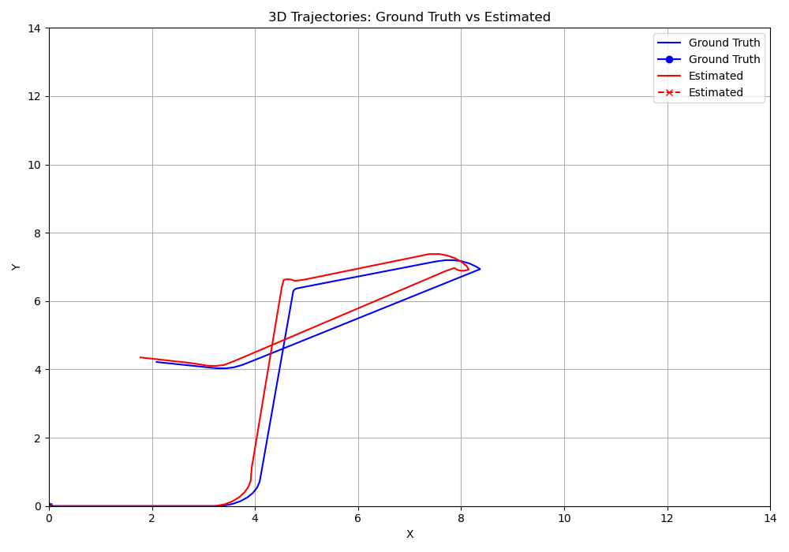
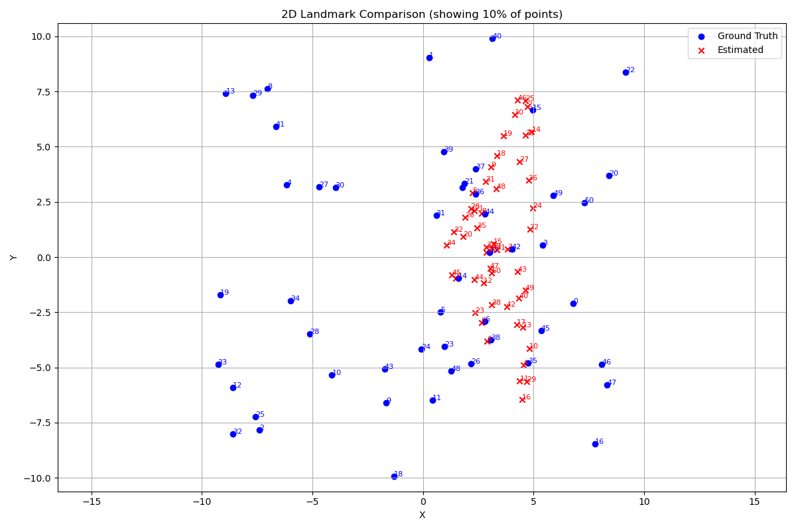
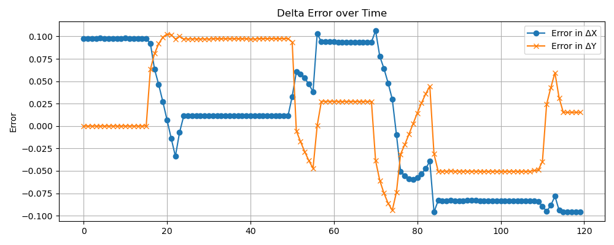
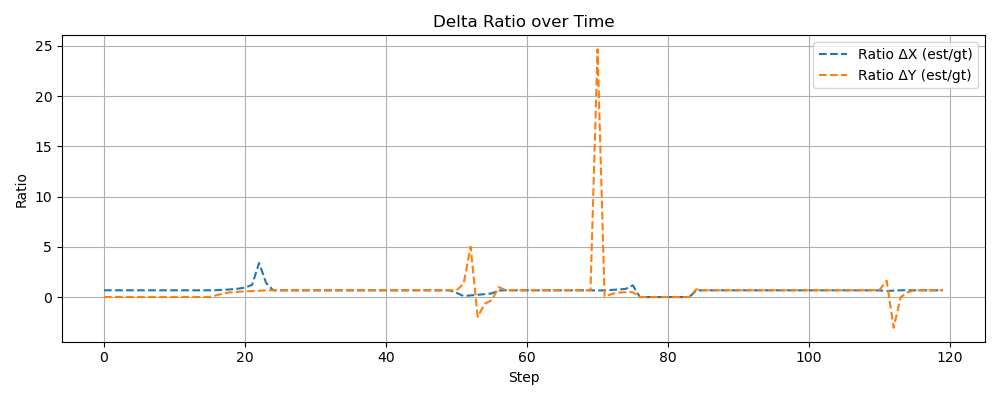

# Probabilist_Robotics: Visual Odometry 

## 🧠 Abstract

This project implements a **Visual Odometry (VO)** system that estimates the motion of a camera in a 3D environment using a sequence of monocular images. It combines techniques such as epipolar geometry, triangulation, and point cloud alignment (PICP) to reconstruct the camera trajectory and generate a sparse 3D map of the observed world.

The system is designed for educational and research purposes and includes various modules for camera modeling, geometric estimation, data handling, and performance evaluation.

---

## 📁 Repository Structure

```
.
├── include/             # Header files (camera model, geometry, utils, etc.)
├── src/                 # Source files and tests
│   └── test_file/       # Unit and integration tests
├── data/                # Input data (camera intrinsics, measurements, world groundtruth)
├── exec/                # Executables, result plots, and output logs
│   ├── plot/            # Plot images generated by the executables
│   └── result_txt/      # Output text result files
├── build/               # Build directory (CMake output)
├── CMakeLists.txt       # CMake configuration
├── README.md            # This file
```

---

## 🚀 How to Run

1. **Build the project:**
   ```bash
   cd <path>/Visual_Odometry && mkdir build && cd build && cmake .. && make && cd../exec
   ```

2. **Run the executables:**
   ```bash
   ./vo_system                   # Look VO system working
   ./vo_system_evaluation        # VO system with evaluation information
   ./vo_system_evaluation_map    # VO system with map information
   ```

3. **Visualize results:**
   ```bash
   python3 show_trajectory.py <gt_file> <est_file>  # Plot camera trajectory
   python3 show_map.py <gt_map> <est_map.txt>       # Plot landmark map
   python3 show_delta.py <file_delta.txt>           # Plot delta e ratio
   ```
---
## 🧪 Methodology

The Visual Odometry system is divided into several functional modules, each responsible for a critical stage in the processing pipeline:

### 🔧 Camera Modeling  
This module defines the camera projection model. It uses the provided intrinsic parameters to map 3D world points to 2D image coordinates. It supports back-projection and normalization operations, which are essential for triangulation and point matching.

### 📐 Geometric Estimation  
This module implements core epipolar geometry techniques to estimate the relative motion between two image frames. It includes:
- Computation of the fundamental and essential matrices  
- Extraction of relative pose (R, t)  
- Triangulation to recover observed 3D points  

### 🔄 Pose Estimation  
This module performs point-to-point alignment using the Iterative Closest Point (ICP) algorithm. It refines the relative pose between consecutive frames by minimizing the distance between corresponding 3D points. This step is crucial for correcting small errors and improving the robustness of trajectory estimation.

### 🎥 Visual Odometry System  
This is the central pipeline that orchestrates the full visual odometry process. It integrates the outputs from camera modeling, geometric estimation, and pose refinement to continuously estimate the camera's trajectory. It also manages the incremental reconstruction of a sparse 3D map of the environment, updating it as new observations become available.
The system iterates over a sequence of 120 measurements. The procedure is structured as follows:

1. **Initialization (first two frames):**  
   The first two measurements are used to compute the initial relative pose using geometric estimation techniques. This step also provides the initial triangulation of 3D world points, serving as the foundation for the map.

2. **Main loop (subsequent frames):**  
   For each new frame *i*, the relative pose $\( \mathbf{T}_{i-1}^i \)$ is estimated with respect to the previous frame *(i-1)* using the established 3D-2D correspondences and pose estimation techniques.

3. **Global transformation:**  
   Once the relative pose is computed, it is transformed into the global coordinate frame to maintain consistency across the full trajectory. The current pose and any new triangulated landmarks are expressed in the world frame.

---

## 📏 Metrics Used

### 1. **Trajectory Evaluation**  
Measures the ratio between the estimated and groundtruth relative translations:

$$
\sum_i \frac{ \left\| \mathbf{T}_i(1{:}3\,4) \right\| }{ \left\| \mathbf{T}_i^{\text{gt}}(1{:}3\,4) \right\| }
$$

---

### 2. **Map Evaluation**  
Compares estimated 3D landmarks against the groundtruth positions using RMSE:

$$
RMSE = \frac{1}{N} \sqrt{ \sum_{i=1}^N \| \mathbf{X}_i^{\text{gt}} - \mathbf{X}_i^{\text{est}} \|^2 }
$$

---

### 3. **Translation and Rotation Errors**

For each estimated pose compared with groundtruth:

- **Translation Evaluation**: Cumulative translation error over all frames.  
- **Rotation Evaluation**: Cumulative rotation error over all frames.

**Variance values:**

$$
\mathrm{Var}(\mathbf{e}) = \frac{1}{N - 1} \sum_{i=1}^N \left( \mathbf{e}_i - \bar{\mathbf{e}} \right)^2
$$

Where:
- $\mathbf{e}_i = \mathbf{t}_i^{\text{gt}} - \mathbf{t}_i^{\text{est}}$
- $\bar{\mathbf{e}} = \frac{1}{N} \sum_{i=1}^N \mathbf{e}_i$

Component-wise translation error and variance are also computed to capture per-axis accuracy.

---


---

## 📊 Plots

All result plots are located in the `exec/` folder:

- **`plots/`** — Contains all generated plot images:
  - `delta_error.png`
  - `delta_ration.png`
  - `map_2d.png`
  - `map_2d_scaled.png`
  - `map_3d.png`
  - `trajectory_2d.png`
  - `trajectory_2d_scaled.png`
  - `trajectory_3d.png`

- **`result_txt/`** — Contains output text files with results:
  - `delta_comparison.txt`
  - `evaluation.txt` — Result on the estimated trajectory
  - `evaluation_map.txt` — Result on the estimated map
  - `result_map.txt` — Estimated map
  - `result_map_scaled.txt` — Scaled estimated map
  - `trajectory_complete.txt` — Estimated camera trajectory
  - `trajectory_complete_scaled.txt` — Scaled estimated camera trajectory
  - `trajectory_gt.txt` — Groundtruth trajectory
  - `world.txt`

To generate plots:
```bash
cd <path>/Visual_Odometry/exec
python3 show_trajectory.py trajectory_gt.txt trajectory_complete.txt
python3 show_map.py world.dat result_map.txt
python3 show_delta.py delta_comparison.txt
```

| Trajectory Plot                                 | Landmarks Comparison Plot    |
|-------------------------------------------------|-----------------------------------------------|
|      |             |
| Delta Plot                           |  Ratio Plot                            |
|     |                              |


